# 使用教程

> 从零开始，一步步教你用这个工具编制施工进度计划。
>
> 如果你还没下载，先看 [README](../README.md) 的「快速开始」。
> 教程里的配图都在 [`docs/images/`](images/) 下。

---

## 目录

1. [界面速览](#一界面速览)
2. [每个按钮是干什么的](#二每个按钮是干什么的)
3. [核心概念：搭接关系怎么用](#三核心概念搭接关系怎么用)
4. [高效录入任务的技巧](#四高效录入任务的技巧)
5. [完整示例：从零编一份计划](#五完整示例从零编一份计划)
6. [进阶技巧](#六进阶技巧)
7. [常见问题](#七常见问题)

---

## 一、界面速览

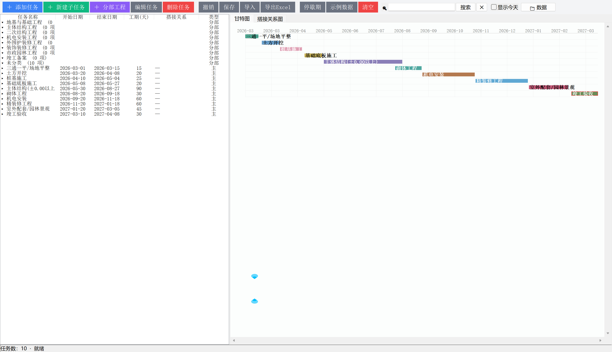

界面分成四块：

| 区域 | 位置 | 作用 |
|------|------|------|
| **工具栏** | 顶部 | 所有操作按钮都在这 |
| **任务列表** | 左侧 | 你的任务清单（可展开/折叠层级） |
| **图表区** | 右侧 | 甘特图 / 搭接关系图两个页签 |
| **状态栏** | 最底部 | 显示当前操作结果、数据位置提示 |

**左侧和右侧是联动的** —— 点左侧某个任务，右侧甘特图会自动滚到它并高亮。

> 💡 鼠标按住图表空白处拖动，可以平移画布。

---

## 二、每个按钮是干什么的


### 新建类（蓝色/绿色/紫色）

| 按钮 | 作用 | 什么时候用 |
|------|------|-----------|
| **＋ 添加任务** | 新建一个**主任务**（顶层工作项） | 建"土方开挖""主体结构"这类主工序 |
| **＋ 新建子任务** | 在某个主任务下**批量生成子任务**（如按楼层） | 主体结构要拆成 2F~18F 时 |
| **＋ 分部工程** | 新建一个**分类容器**（∈ 分部工程） | 按"地基与基础/主体结构/装修"分类 |

> 📌 **分部工程不是任务**，它只是个"文件夹"。详见[第五节](#五完整示例从零编一份计划)。

### 编辑类

| 按钮 | 作用 |
|------|------|
| **编辑任务** | 打开选中任务，改名称/日期/工期/搭接关系 |
| **删除任务** | 删除选中任务（含其子任务） |
| **撤销** | 后悔药，可回退最近 50 步 |

### 文件类

| 按钮 | 作用 |
|------|------|
| **保存** | 存成一个 `.json` 文件（可备份、可发给别人） |
| **导入** | 打开之前保存的 `.json` |
| **导出Excel** | 生成 Excel 报表，两个工作表：主任务计划 / 全部任务 |
| **停歇期** | 设置春节、雨季等停工期，落在期间的任务会自动顺延 |

### 辅助类

| 按钮 | 作用 |
|------|------|
| **示例数据** | 载入一份演示数据，用来熟悉界面 |
| **清空** | 清空所有任务（会先询问） |
| **🔍 搜索框** | 输入即出候选，双击结果直接跳过去 |
| **☐ 显示今天** | 勾选后，甘特图上出现红色虚线标出今天 |
| **📁 数据** | 打开数据所在文件夹（找不到数据时点它） |

### 右键菜单（在任务行上点右键）

除了上面的操作，右键还能：

- **移入分部 ▸** —— 把任务归到某个分部（也可直接用鼠标拖）
- **展开/收起子任务** —— 快速折叠
- **新建分部工程…** —— 建新分类

在**分部行**上右键，还能**重命名**、**删除**该分部。

---

## 三、核心概念：搭接关系怎么用

### ⚠️ 最重要的一条建议

> **建任务时，请用「前置任务 + 搭接时间」来定义工序关系，
> 而不是只写开始/结束日期。**

**为什么？** 两个原因：

**① 搭接关系图才画得对**

右侧的「搭接关系图」是靠**前置关系**来连线、分层的。如果任务之间没有前置关系，这张图就是一堆散点，看不出工序流向。

**② 改工期能自动顺延**

设置了搭接关系后，你把某个任务的工期改了，**它后面的任务会自动跟着挪**：

```
未设搭接：改了"土方开挖"的工期 → "桩基施工"还停在原日期 → 计划错乱
已设搭接：改了"土方开挖"的工期 → "桩基施工"自动往后顺延 ✔
```

### 怎么设

双击任务 → 打开对话框：

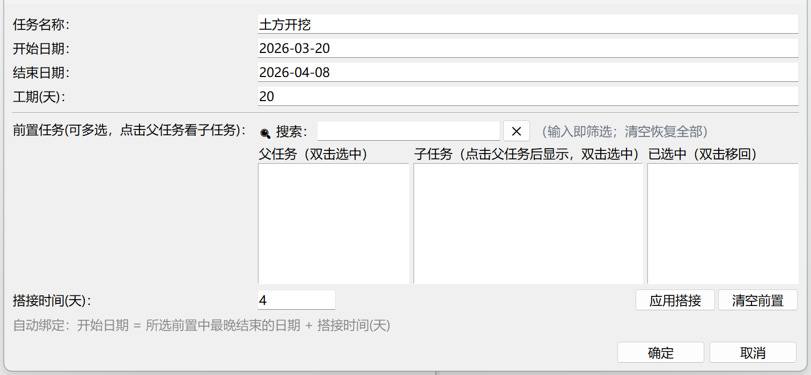

操作步骤：

1. **左侧「父任务」列表**里找到要作为前置的任务，**双击**它 → 移到「已选中」
2. 如果前置是个子任务：先**单击**父任务，右侧「子任务」列表会显示它的子任务，再双击选中
3. 填**「搭接时间(天)」**
4. 点**「确定」**

### 搭接时间填多少？

界面底部的提示说明了算法：

> **开始日期 = 所选前置中"最晚结束的日期" + 搭接时间(天)**

| 你填 | 意思 | 例子 |
|------|------|------|
| `0` | 前面干完第二天就开工 | 常规顺序施工 |
| `5` | 前面干完再等 5 天 | 需要养护、检测等待 |
| `-10` | 前面还没干完，提前 10 天进场 | **搭接施工**（重叠作业）|

**工程上的典型用法**：

```
主体结构  →  砌体工程     搭接时间 = 0    （结构封顶后再砌墙）
室外工程  →  室内装修     搭接时间 = -30  （提前插入装修）
桩基施工  →  桩基检测     搭接时间 = 28   （留出养护期）
```

### 优先级说明

如果一个任务有**多个前置**，程序取**最晚结束的那个**再加减搭接时间。

---

## 四、高效录入任务的技巧

### 技巧 1：自上而下，先搭骨架

**别一上来就录入 200 行**。先建十几条主任务，把主线拉通：

```
三通一平 → 土方开挖 → 桩基施工 → 基础底板 → 主体结构
→ 砌体工程 → 机电安装 → 装饰装修 → 竣工备案
```

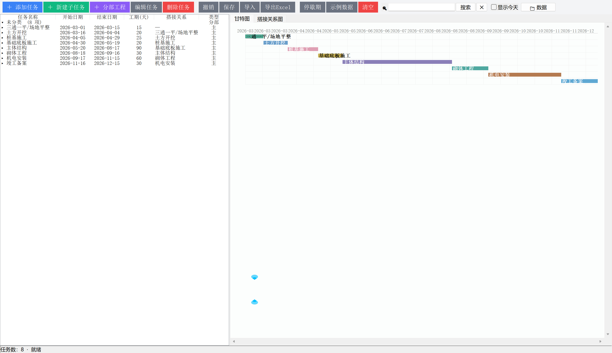

搭接关系先按大工序设好，**细化留到后面**。

### 技巧 2：用「标准层」批量生成子任务

主体结构 2F~18F 这种**重复性工序**，不要手动加 17 行。

点「＋ 新建子任务」，选**标准层**模式：

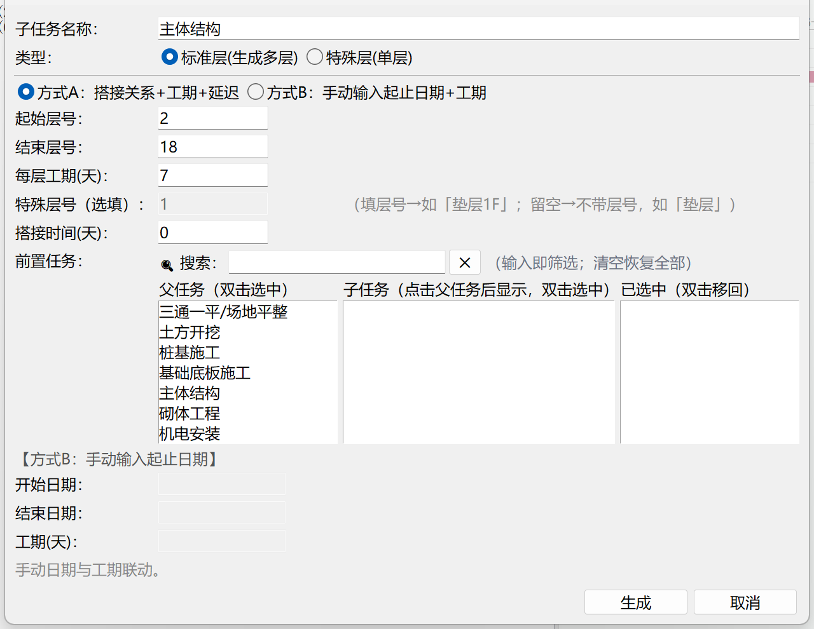

填三个数就行：

| 字段 | 例子 | 意思 |
|------|------|------|
| **起始层号** | 2 | 从 2 层开始 |
| **结束层号** | 18 | 到 18 层结束 |
| **每层工期** | 7 | 每层 7 天 |

点确定 → **一次生成 2F、3F、…、18F 共 17 个子任务**，日期自动递增排好。

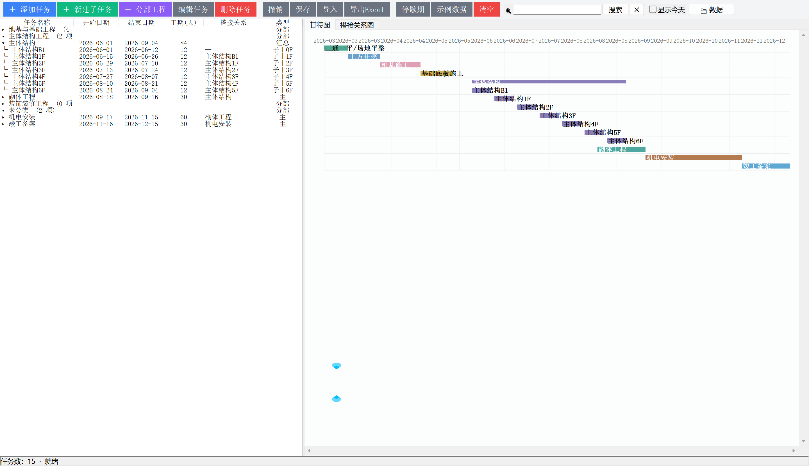

> 还有「特殊层」模式，用于 B1、屋面这种单独的层。

### 技巧 3：用分部工程给任务分类

任务多了以后，列表会很长。用**分部工程**把它们分堆：

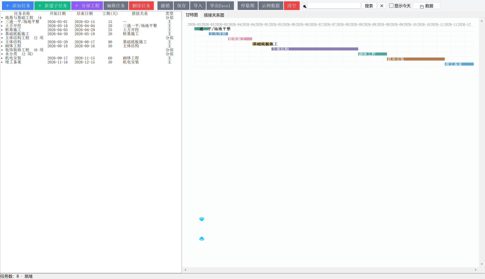

建好后，**折叠**起来就只有几行，特别清爽：

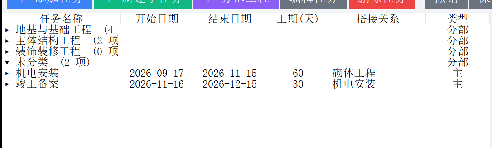

### 技巧 4：善用搜索

任务一多，找起来麻烦。右上角搜索框：

- 打字 → 实时出候选
- **双击候选** → 直接跳过去，命中的行标黄
- 会自动展开它所在的分部和父任务，并滚动到屏幕中间

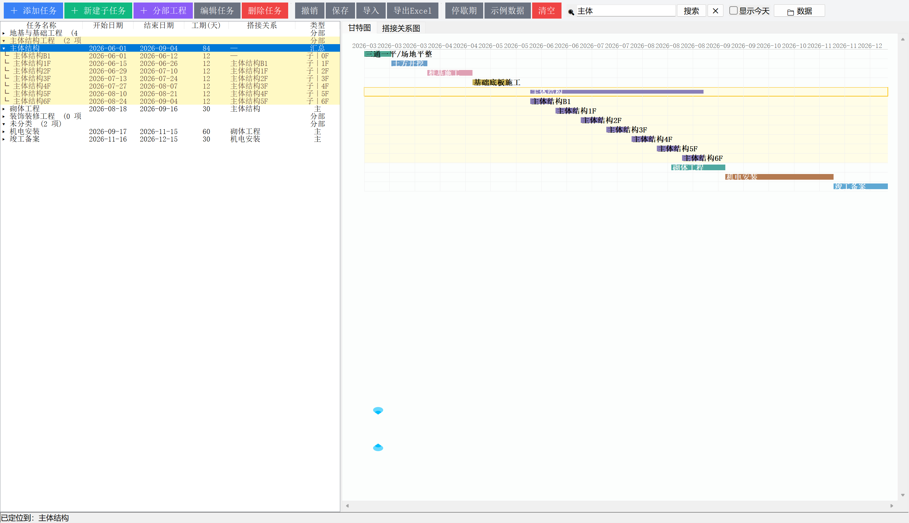

### 技巧 5：搭接关系用「编辑任务」批量补

骨架搭好后，逐个双击任务补前置关系。**从前往后补**，因为后面的任务要引用前面的。

---

## 五、完整示例：从零编一份计划

假设要编一个"某住宅楼"的进度计划。

### 第 1 步：清空，从零开始

点「清空」（或新装的软件本身就是空的）。

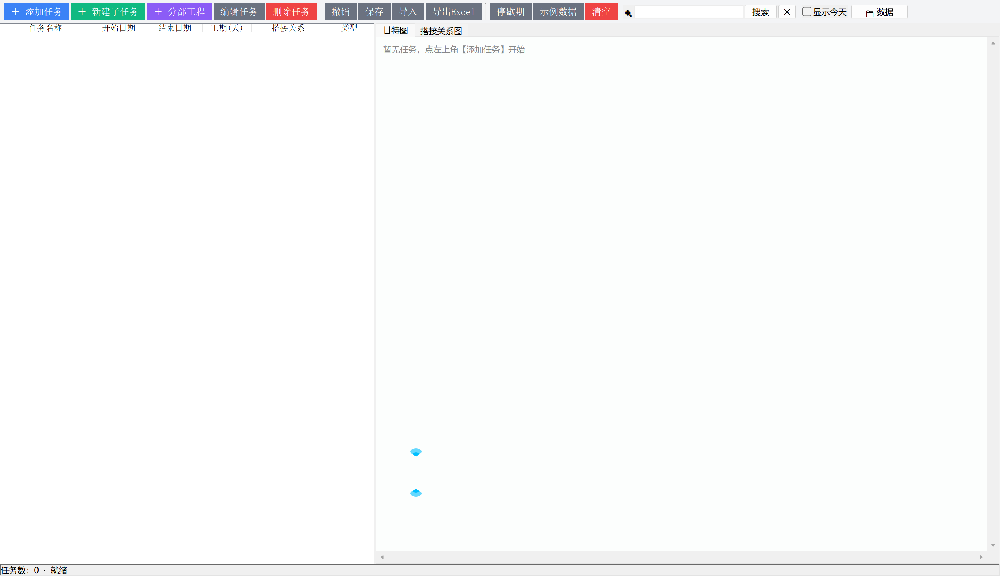

### 第 2 步：建分部工程

先建三个分类：

1. 点「＋ 分部工程」→ 输入 `地基与基础工程`
2. 再建 `主体结构工程`
3. 再建 `装饰装修工程`

### 第 3 步：录主任务

点「＋ 添加任务」，逐个录入：

| 任务名称 | 开始日期 | 工期(天) | 前置任务 | 搭接时间 |
|---------|---------|---------|---------|---------|
| 三通一平/场地平整 | 2026-03-01 | 15 | — | — |
| 土方开挖 | 自动 | 20 | 三通一平/场地平整 | 4 |
| 桩基施工 | 自动 | 25 | 土方开挖 | 3 |
| 基础底板施工 | 自动 | 20 | 桩基施工 | 3 |
| 主体结构 | 自动 | 90 | 基础底板施工 | 2 |

> 📌 注意：**填了前置任务后，开始日期会自动算**，不用手填。
> （表格里"自动"那几格，就是程序按搭接关系算出来的）

### 第 4 步：把任务归入分部

**方式一（拖）**：
按住「土方开挖」→ 拖到「地基与基础工程」那行上（该行会亮起来）→ 松手

**方式二（右键）**：
右键「土方开挖」→「移入分部 ▸」→「地基与基础工程」

归类结果：

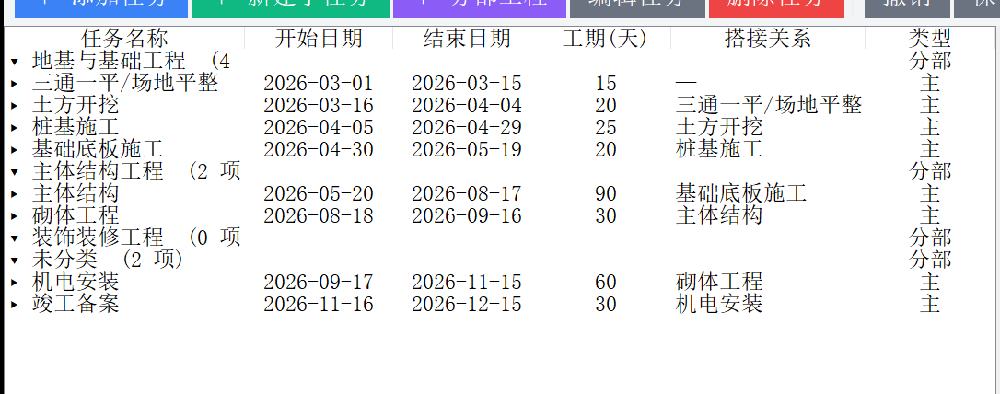

### 第 5 步：建子任务（主体结构拆楼层）

右键「主体结构」→「新建子任务」，或者点工具栏的「＋ 新建子任务」：


设置：
- 模式：**标准层(生成多层)**
- 起始层号：`2`
- 结束层号：`18`
- 每层工期：`7` 天

确定后，主体结构下就多了 17 个子任务：


> 💡 子任务之间**自动串联**（2F 干完干 3F），不用手动设搭接。

### 第 6 步：检查搭接关系图

切到「搭接关系图」页签：

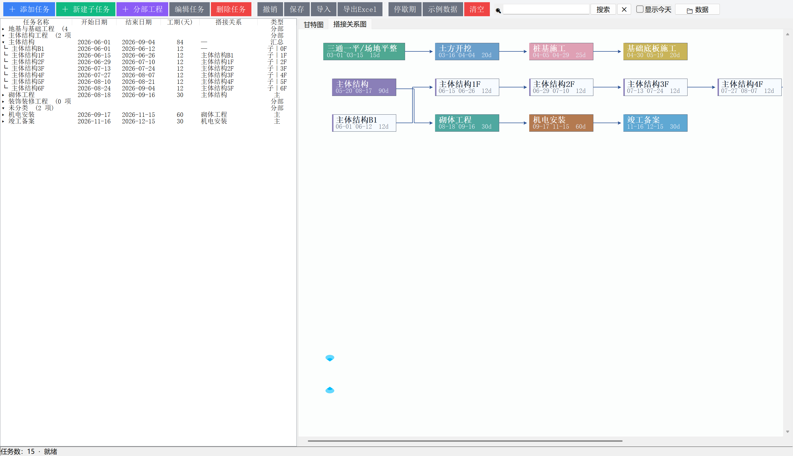

这张图能直观看出：

- **工序流向**：箭头从哪指向哪
- **哪些是并行**、哪些是串行
- **搭接时间**：连线上的标注（如 `+3d`、`-32d`）

**如果这张图很乱或很空**，说明搭接关系没设好 —— 回去补前置任务。

### 第 7 步：看当前进度（显示今天）

勾选「☐ 显示今天」：

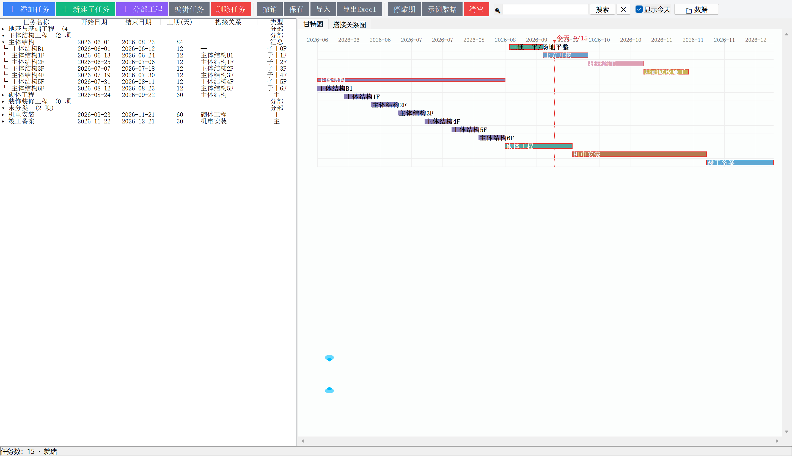

红色虚线标出今天的位置，一眼看出：

- 哪些任务**现在应该正在进行**
- 各任务**干到哪个位置**了

> 如果今天的日期不在你的计划范围内，这条线不显示（因为没地方画）。

### 第 8 步：导出报表

点「导出Excel」，得到一个 Excel 文件，含两个工作表：

- **主任务计划** —— 只有主任务，按开始时间排序
- **全部任务计划** —— 含子任务，层级排列

两个表都带甘特色块，可以直接打印或放进汇报材料。

---

## 六、进阶技巧

### 1. 缩放看细节

按住 **Ctrl + 滚轮** 缩放画布（25% ~ 400%）：

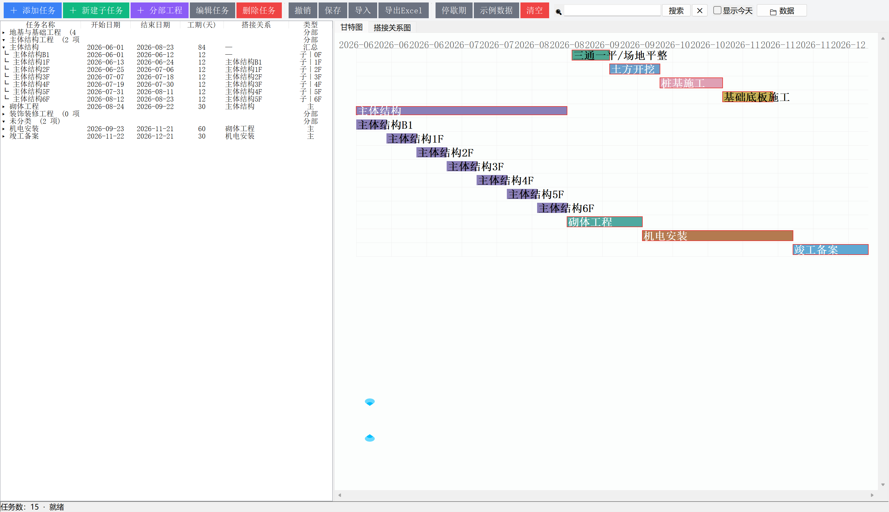

- 想看清某几天的细节 → 放大
- 想看整个项目全貌 → 缩小

普通滚轮 = 上下滚动。

### 2. 停歇期（春节、雨季）

点「停歇期」，添加一个时间段（如春节 2/10~2/20）。
落在停歇期内的任务，**开始/结束会自动顺延**到假期结束。

### 3. 用「搭接时间」做提前插入

想表达"室内装修提前插入"，就在室内装修的搭接时间填**负数**：

```
室内抹灰  前置=主体结构  搭接时间 = -45
```

意思是：主体结构还没干完，提前 45 天就进场抹灰。

### 4. 数据在哪？怎么备份？

点工具栏的「📁 数据」按钮，直接打开数据文件夹。

- **打包版**：数据在 `我的文档\Project Gante\`
- **源码运行**：数据在程序所在文件夹

备份就把整个 `Project Gante` 文件夹拷走。

---

## 七、常见问题

**Q：任务很多，列表太长怎么办？**

A：用**分部工程**分类 + **折叠**。折叠后一屏就能看完所有分部。

---

**Q：搭接关系图为什么空空的 / 很乱？**

A：说明**前置关系没设**或**设得不合理**。检查：
- 每个任务（除第一个）是不是都有前置？
- 有没有形成闭环（A 等 B、B 又等 A）？闭环会被跳过。

---

**Q：改了工期，后面的任务没跟着动？**

A：那个任务**没设前置关系**。只有设了前置，才会自动顺延。

---

**Q：开始日期填了，但一保存就变了？**

A：因为该任务**有前置关系**，程序按"前置最晚结束日 + 搭接时间"重算了。
如果这个任务确实要手动定日期，就**清空它的前置任务**。

---

**Q：数据会不会丢？**

A：程序每次改动都**自动保存**。而且万一数据突然变少，它会先把旧文件备份一份。

---

**Q：能多人协作吗？**

A：不能。这是**单机工具**。要分享计划，用「保存」导出 `.json` 发给对方导入，或者直接导出 Excel。

---

**Q：支持 Mac / Linux 吗？**

A：源码运行本身是跨平台的（Python + Tkinter），但**打包的 exe 只有 Windows 版**。
Mac/Linux 用户可以 `python gantt_tool.py` 从源码跑。

---

## 还有问题？

去 [Issues](../../issues) 提出来 —— 这工具就是从实际排期的麻烦里长出来的，
**你的痛点比什么都重要**。
